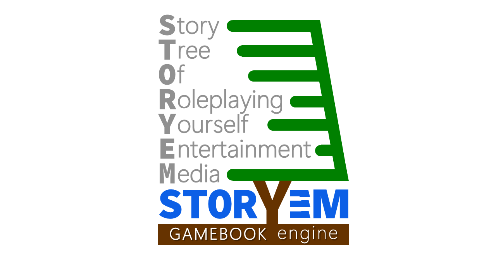
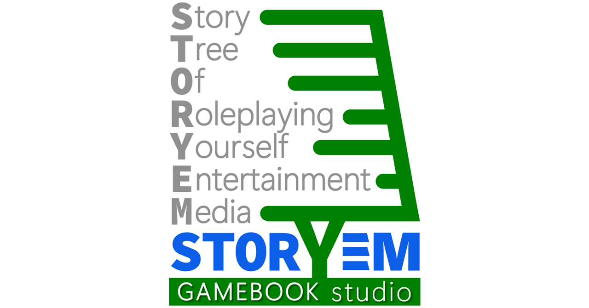
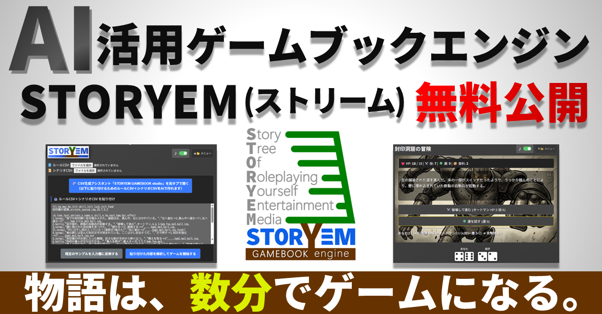

# STORYEM (Pronunciation:Stream)  
**Story Tree Of Roleplaying Yourself Entertainment Media**  
  
[English](#english-version) | [日本語](#japanese-version)  
  
---  
  

  
  
# STORYEM  
### Gamebook Creation & Execution Engine for the AI Era  
  
> "What if the story you imagined became a game on the spot?"  
  
STORYEM is a tool that revives the world of choose-your-own-adventure "gamebooks" using the power of the latest AI.  
  
---  
  
## 【Introduction】  
No programming knowledge is required. With the **Studio function** that supports dialogue with ChatGPT or Gemini, anyone can create their own gamebook in "just a few minutes."  
  
For those who can use Excel, it is also possible to create large-scale masterpieces with up to 2,000 paragraphs. Once uploaded to a web server, the possibilities are endless: tourism guides, in-house training, educational materials, quizzes, cinematic novels, and more. This engine, which is free to modify and use commercially, is now available as a complete set.  
  
---  
  
---  
  
## ① Play the Built-in Sample Game in 30 Seconds!  
Let's play first without any complicated theories!  
  
1.  **Download and Extract**: Download storyem.  
2.  **Launch**: Open `index.html` in the folder using a browser like Chrome or Firefox.  
3.  **Reflect Sample**: Click **"Load the Built-In Sample"** from the "▼📁 menu" in the top right.  
4.  **Start**: Once the data is reflected, click **"Analyze and Start Game"**!  
  
This starts "The Sealed Warehouse." This sample is stored inside `index.html` and can be retrieved at any time.  
  
### File Structure  
The only thing you need is `index.html`, which is less than 100KB. No external libraries or server connections are required. It even works offline.  
  
---  
  
## ② Try Rewriting the World a Little  
The true identity of STORYEM is **"CSV (Comma-Separated Values)"**.  
Try rewriting the title or text in the input field within the "▼📁 menu."  
  
After rewriting, press "Analyze and start game" again. Just by changing the enemy's name to "The Teacher When You Forgot Your Homework," the atmosphere of the story changes completely.  
  
---  
  
## ③ Loading External CSV Files  
You can also load your own CSV files from "Select File" at the top of the "▼📁 menu." One game consists of two files: "Rule CSV" and "Scenario CSV."  
  
The included `rule.csv` and `scenario.csv` are a full version sample "The Sealed Cave" with images and music.  
  
* **Battle**: Conducted with 2 dice + Skill points. There is also a chance to increase damage by "Try your Luck."  
* **Survival**: Eat provisions at resting areas to heal your wounds and aim for the ending!  
  
---  
  
## ④ Magic Tool: Create Your Own Game with STORYEM Studio  
  
  
  
Don't worry if you can't write CSV! By using the included `studio_eng.html`, you can automatically generate complex instructions (prompts) for AI.  
  
1.  **Enter Overview**: Write your idea, for example, "An arcane duel over the last Scotch egg in a rain-slicked pub at closing time."  
2.  **Launch AI**: Click "Copy Prompt & Launch AI." Choose ChatGPT or Gemini.  
3.  **Paste**: Paste into the AI chat field with "Ctrl+V" and send!  
4.  **Copy CSV**: Copy the CSV data generated in a few minutes.  
5.  **Reflect**: Paste it into the STORYEM engine menu and start!  
  
### 🛠️ Tips for "Evolving" Your Game  
If you ask the AI to "make it scarier" or "change the protagonist's tone," the game will evolve. By pasting an existing CSV into `studio_eng.html` and instructing it to "increase the difficulty," a "major update" can be completed instantly.  
  
---  
  
## ⑤ Enhance Immersion with Images and Music  
AI is also good at suggesting prompts for illustrations.  
  
* **Images (bgi)**: Place in the `img` folder and specify as `img/filename.png` in the CSV.  
* **Music (bgm)**: Place in the `bgm` folder and specify as `bgm/filename.mp3` in the CSV.  
  
Adding music makes it a "pro-grade" game.  
  
---  
  
## ⑥ 【Advanced】 Unleash Your Craftsmanship with Excel  
For a masterpiece comparable to commercially available gamebooks, use Excel. It supports up to 300,000 characters and 2,000 paragraphs.  
  
> [!IMPORTANT]  
> **Steps to Prevent Character Encoding Issues**  
> * Open the CSV file in a text editor, overwrite it with **"UTF-8 with BOM"**, then open it in Excel and edit.  
> * After editing and saving in Excel, when reading in STORYEM, it is recommended to overwrite and save with **"UTF-8 without BOM"** in a text editor.   
  
---  
  
## ⑦ Publish to the World via Web Server!  
Simply upload the `storyem` folder to a web server (or GitHub Pages, etc.). If you fix the filenames to `rule.csv` and `scenario.csv` and place them in the same hierarchy as `index.html`, the game will start automatically upon access.  
  
---  
  
## ⑧ Copyright and Terms of Use  
  
| Category | Content |  
| :--- | :--- |  
| **Engine Body** | **MIT License**: Free to modify and use commercially. Keep the copyright notice. |  
| **Sample Assets** | **Rights Reserved**: Extraction, secondary distribution, or diversion of assets is prohibited. |  
| **Credit** | **Optional**: Mentions like "Powered by STORYEM" or links to this repository are appreciated. |  
  
---  
  
## ⑨ Infinite Applications  
Adventure is not the only game.  
Tourism guides, learning quizzes, workflow simulators... If you remove branches and use many animated GIFs, it can also be a cinematic novel. Please find the possibilities with your own hands.  
  
Now, hold onto your hope and start writing the first paragraph, "§ 1." Good luck!  
  

  
  
---  
  

  
  
  
  
# STORYEM (ストリーム)  
### AI時代のゲームブック・制作＆実行エンジン  
  
---  
> 「もし、自分の考えた物語が、その場でゲームになったら？」  
  
かつて夢中になった、選択肢で進む「ゲームブック」の世界を、最新AIの力を借りて蘇らせるツールです。  
  
---  
  
## 【まえがき】  
プログラミング知識は不要。ChatGPTやGeminiとの会話をサポートする**スタジオ機能**で、誰でも自分だけのゲームブックを「数分で」作れます。  
  
さらに、Excelが使える方は、高度で複雑な2000パラグラフ級の大作も制作可能です。Webサーバーにアップすれば、観光案内、社内研修、学習教材、クイズ、シネマティックノベルなど、活用法は無限。改変も商用利用も自由な本エンジンを、一式セットで無料公開します。  
  
※以下のマニュアルは、往年のゲームブック調の言い回しを含めてお楽しみください。  
  
---  
  
---  
  
## ① まずは30秒で内蔵サンプルゲームを遊ぶ！  
まずは理屈抜きで遊んでみよう！  
  
1. **ダウンロードと展開**：一式 をダウンロードし、右クリックして「すべて展開」で解凍しよう。  
2. **起動**：フォルダ内の `index.html` をChromeやFirefox等のブラウザで開こう。  
3. **サンプルの反映**：右上の「▼📁 メニュー」から「既定のサンプルを入力欄に反映する」を押す。  
4. **開始**：データが反映されたら、「貼り付けた内容を解析してゲームを開始する」をクリック！  
  
これで「封印庫の冒険」が開始される。このサンプルは `index.html` 内部に格納されており、いつでも読み出し可能だ。  
  
### STORYEMのファイル構成  
最低限必要なのは100KB未満の `index.html` だけ。外部ライブラリやサーバー接続は一切不要。オフラインでも動作するのだ。  
  
---  
  
## ② ほんの少し、世界を書き換えてみよう  
STORYEMの正体は「CSV（カンマ区切りテキスト）」だ。  
「▼メニュー」の入力枠内にあるタイトルや文章を、少しだけ書き換えてみよう。  
  
書き換えたら「解析してゲームを開始する」を押し直そう。敵の名前を「宿題を忘れた時の先生」に変えるだけで、物語の空気は一変する。  
  
---  
  
## ③ 外部のCSVファイルを読み込んでみよう  
「▼メニュー」上部の「ファイルを選択」から、手元のCSVを読み込むこともできる。「ルールCSV」と「シナリオCSV」の2枚で1本のゲームとなる。  
  
同梱の `rule.csv` と `scenario.csv` は、画像や音楽が付いた本格版サンプル「封印洞窟の冒険」だ。1つずつ読み込むと扉絵が表示され、冒険が始まる！  
  
戦闘はサイコロ2個＋技術点で行われ、運試しでダメージ増加のチャンスもある。休憩所で食料を食べ、傷を癒しながら結末を目指せ！  
  
---  
  
## ④ 魔法のツール：STORYEM studioで「自分専用ゲーム」を作る  
  
  
  
---  
  
「CSVなんて書けない！」という方も安心せよ。同梱の `studio.html` を使えば、AIへの複雑な指示（プロンプト）を自動生成できる。  
  
1. **概要を入力**：「深夜のコンビニで賞味期限切れ弁当を巡る異能力バトル」等、妄想を書き込む。  
2. **AIを起動**：「プロンプトをコピーしてAIを起動」をポチッ。ChatGPTかGeminiを選ぼう。  
3. **貼り付け**：起動したAIのチャット欄に「Ctrl+V」で貼り付けて送信！  
4. **CSVをコピー**：数分で生成されるCSVデータをコピーする。  
5. **反映**：STORYEM本体のメニューに貼り付けて開始！  
  
### 🛠️ ゲームを「改訂」して育てるコツ  
AIに「もっと怖く」「主人公の口調を『～だぜ』に」と頼めば、ゲームは進化する。  
既存のCSVを `studio.html` に貼り付けて「難易度を上げて」と指示すれば、爆速で『大型アップデート版』が完成するのだ。  
  
---  
  
## ⑤ 画像と音楽をつけて、没入感を高めよう  
AIは挿絵のプロンプト提案も得意だ。  
  
* **画像(bgi)**：`img` フォルダに入れ、CSVで `img/filename.png` と指定。  
* **音楽(bgm)**：`bgm` フォルダに入れ、CSVで `bgm/filename.mp3` と指定。  
  
---  
  
## ⑥ 【高度な作り方】Excelで職人魂を燃やす  
市販のゲームブックに匹敵する大作ならExcelの出番だ。最大30万文字、2000パラグラフまで対応。あの名作『ソーサリー』第4巻分に近い規模の作品も、1ファイルに収まる。  
  
> **重要：文字化けを防ぐ手順**  
> 1. CSVファイルをテキストエディタで開き、「BOM付きUTF-8」で上書き保存後、Excelで開いて編集。  
> 2. Excelで編集・保存後、STORYEMで読み込む際はテキストエディタで「BOMなしUTF-8」で上書き保存することを推奨。  
  
---  
  
## ⑦ Webサーバーで世界へ公開！  
`storyem` フォルダをそのままWebサーバーやGitHub Pages等にアップすればOK。  
ファイル名を `rule.csv` `scenario.csv` で固定して `index.html` と同じ階層に置けば、アクセスした瞬間にゲームが自動起動する。  
  
---  
  
## ⑧ 著作権と利用規約  
  
| 区分 | 内容 |  
| :--- | :--- |  
| **エンジン本体** | MITライセンス：改造・商用利用自由。著作権表示は維持すること。 |  
| **サンプル素材** | 著作権保留：素材のみの二次配布・転用は禁止。 |  
| **クレジット** | 任意：「Powered by STORYEM」等の表記を推奨。 |  
  
---  
  
## ⑨ 無限に広がる活用法  
冒険だけが、ゲームではない。観光案内、学習クイズ、業務フローシミュレーター……。  
可能性はあなた自身の手で探し出してほしい。  
  
さあ、希望を握りしめ、最初のパラグラフ「§ 1」を書き始めてみよう。健闘を祈る！  
  

  
  
---  
  
## License & Credits  
- **Engine (HTML/JS/CSS)**: [MIT License](LICENSE)  
- **Sample Assets (Images/BGM)**: All Rights Reserved (Copyright (C) 2026 Factory Digital Entertainment)  
- **Developer**: Factory Digital Entertainment / Hironov Yazaki